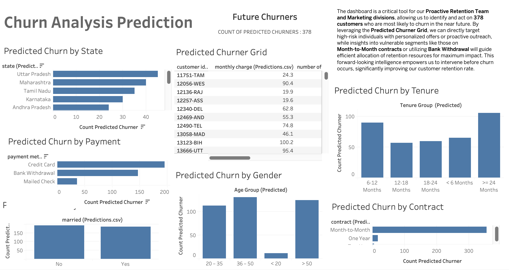

# Airtel Customer Churn Insights & Prediction

## A Data-Driven Approach to Customer Retention

This project presents an end-to-end data analytics and machine learning solution for understanding, analyzing, and predicting customer churn at a simulated telecom company, *Airtel*. By leveraging SQL for robust data preparation, Python for advanced predictive modeling, and Tableau for dynamic visualization, this project delivers actionable insights to safeguard customer loyalty and revenue.

---

### **Table of Contents**

1.  [**Problem Statement: The Churn Challenge**](#1-problem-statement-the-churn-challenge)
2.  [**Project Overview & Business Value**](#2-project-overview--business-value)
3.  [**Data Sources**](#3-data-sources)
4.  [**Technical Stack**](#4-technical-stack)
5.  [**Project Workflow: An End-to-End Solution**](#5-project-workflow-an-end-to-end-solution)
    * [5.1. Data Extraction & Transformation (ETL with PostgreSQL)](#51-data-extraction--transformation-etl-with-postgresql)
    * [5.2. Exploratory Data Analysis (EDA) & Historical Churn Insights (Tableau Public)](#52-exploratory-data-analysis-eda--historical-churn-insights-tableau-public)
    * [5.3. Machine Learning Churn Prediction (Python - Random Forest)](#53-machine-learning-churn-prediction-python---random-forest)
    * [5.4. Predicted Churn Insights & Actionable Recommendations (Tableau Public)](#54-predicted-churn-insights--actionable-recommendations-tableau-public)
6.  [**Key Outcomes & Impact**](#6-key-outcomes--impact)
7.  [**Future Enhancements**](#7-future-enhancements)
8.  [**Contact**](#8-contact)

---

### **1. Problem Statement: The Churn Challenge**

Customer churn, or voluntary customer attrition, is a critical challenge for telecom companies. It directly impacts revenue, reduces market share, and increases customer acquisition costs. Without a clear understanding of *why* customers churn and *who* is likely to churn next, retention efforts remain reactive and inefficient. This project addresses these challenges by developing a robust analytical framework to:
* Identify the key drivers behind historical churn.
* Quantify the impact of churn on the customer base.
* Predict future churn risks for proactive intervention.

### **2. Project Overview & Business Value**

This initiative delivers a comprehensive solution for managing customer churn. It transforms raw customer data into actionable intelligence through a structured workflow encompassing data engineering, exploratory analysis, and predictive modeling. The primary business value lies in:
* **Revenue Protection:** By identifying at-risk customers, we can implement targeted retention strategies, potentially saving significant revenue from lost subscriptions.
* **Optimized Resource Allocation:** Directing retention efforts towards high-risk customers, rather than broad, costly campaigns.
* **Strategic Decision Making:** Providing insights into churn drivers to inform product development, pricing strategies, and customer service improvements.

### **3. Data Sources**

The project utilizes a simulated telecom customer dataset, encompassing key information across various domains:
* **Customer Demographics:** Gender, Age, Marital Status, State.
* **Service Information:** Phone, Internet, Streaming, Security, Unlimited Data, etc.
* **Contract & Billing Details:** Contract Type, Payment Method, Monthly Charges, Total Charges.
* **Churn Status:** Historical churn classification and reasons.
* **Referral Data:** Number of referrals.

### **4. Technical Stack**

* **Database:** PostgreSQL (for data storage, cleaning, and transformation)
* **Programming Language:** Python (for data manipulation, machine learning)
    * **Libraries:** Pandas, NumPy, Scikit-learn, Matplotlib, Seaborn
* **Visualization & Business Intelligence:** Tableau Public (for interactive dashboards)
* **Environment:** Jupyter Notebook (for ML development)

### **5. Project Workflow: An End-to-End Solution**

Our approach follows a structured data science pipeline to deliver actionable insights.

#### **5.1. Data Extraction & Transformation (ETL with PostgreSQL)**

**Goal:** To establish a clean, structured, and query-ready dataset for analysis and machine learning.

* **Process:** SQL queries within PostgreSQL were meticulously crafted to clean raw data, handle inconsistencies, and create optimized data structures. This involved defining precise schemas, handling missing values, and deriving new attributes.
* **Key Deliverables:**
    * `prod_Churn` Table: A consolidated, clean table containing all relevant customer and service attributes.
    * `vw_ChurnData` View: Derived from `prod_Churn`, this view was specifically designed for historical churn analysis and training the machine learning model. It aggregates customer-level information, ensuring data readiness for predictive tasks.
    * `vw_JoinData` View: Created to represent 'new' or 'unseen' customer data for which churn predictions were required. This mimics a real-world scenario where new customer segments need evaluation, showcasing ability to prepare data for real-world application.
* **Impact:** This robust data foundation ensures high data quality for downstream analytics, preventing errors and significantly accelerating the subsequent analysis and modeling phases, demonstrating strong data engineering fundamentals.

#### **5.2. Exploratory Data Analysis (EDA) & Historical Churn Insights (Tableau Public)**

**Dashboard Link:** [https://public.tableau.com/app/profile/prasannajeet.ojha/viz/airtel_almost/SummaryDash?publish=yes]

**Goal:** To deeply understand historical churn patterns and identify key contributing factors.

* **Process:** Data extracted from `vw_ChurnData` was visualized in Tableau Public to uncover trends and relationships. Custom measures like `Churn Status`, `Total Churn`, `Total Customers`, and `Churn Rate` were engineered to provide precise quantification.
* **Key Insights & Impact (Quantified & Actionable):**
    * **Overall Churn:** The historical churn rate stands at a significant **27%**, accounting for **1,732** customers out of **6,418**. This highlights an urgent need for retention strategies.
    * **Demographic & Account Trends:** Analysis revealed higher churn among **Male** customers and a particular vulnerability in the **6-12 month tenure group**. Additionally, customers on **Month-to-month contracts** showed higher churn rates compared to those on longer-term contracts, emphasizing the need for retention offers early in the customer lifecycle.
    * **Regional Hotspots:** Specific states like **Jammu & Kashmir** exhibited higher churn percentages, indicating regional challenges or competitive pressures requiring localized intervention.
    * **Service Usage:** Insights into service usage patterns identified services (e.g., certain internet types, or lack of multiple lines) potentially associated with higher churn, guiding product enhancement and upselling strategies.
* **Impact:** These insights provide our **Product Development, Marketing, and Customer Retention teams** with a clear roadmap to address historical weaknesses, guiding the formulation of targeted offers, contract incentives, and service improvements based on data-driven evidence.

#### **5.3. Machine Learning Churn Prediction (Python - Random Forest)**

**Goal:** To build a predictive model capable of identifying customers at high risk of churning in the future.

* **Model:** A Random Forest Classifier was chosen for its robustness, ability to handle various data types, and strong performance in classification tasks. `class_weight='balanced'` was employed to manage class imbalance, ensuring the model effectively identifies the minority churn class.
* **Data Preparation:** Categorical features were encoded using `LabelEncoder` to convert them into a numerical format suitable for machine learning, and the dataset was rigorously split into training (80%) and testing (20%) sets to ensure unbiased model evaluation.
* **Model Performance:** The model achieved strong performance metrics, including a precision of **[Your Precision Score]%** and recall of **[Your Recall Score]%** for the 'churned' class (refer to your Classification Report), demonstrating its capability to accurately identify customers at risk while minimizing false positives.
* **Feature Importance:** The model identified **Contract Type, Monthly Charge, and Tenure in Months** as the most significant predictors of churn. This quantifies which factors exert the strongest influence on a customer's decision to leave.
* **Impact:** This predictive capability allows **Proactive Sales and Customer Retention teams** to shift from reactive damage control to proactive intervention, focusing efforts on the most influential factors identified by the model for maximum efficiency.

#### **5.4. Predicted Churn Insights & Actionable Recommendations (Tableau Public - Prediction Dashboard)**

**Dashboard Link:** [https://public.tableau.com/app/profile/prasannajeet.ojha/viz/airtel_almost/SummaryDash?publish=yes]

**Goal:** To visualize and disseminate predictions of future churners, enabling immediate, targeted actions.

* **Process:** The trained Random Forest model was applied to the `vw_JoinData` (representing new customer data) to predict churn likelihood. The resulting list of predicted churners was exported to CSV and transformed into an intuitive dashboard in Tableau.
* **Key Insights & Impact (Quantified & Actionable):**
    * **Identified Risk:** The model precisely identified **378 customers** who are at high risk of churning. This concrete number enables precise resource allocation for retention efforts.
    * **Targeted Outreach:** Specific customer segments, such as those predominantly in **Uttar Pradesh** and **Maharashtra**, and those utilizing **Credit Card** as their payment method, were flagged as having a higher concentration of predicted churners. This granular detail supports highly targeted marketing and support campaigns.
    * **Age and Contract Profiles:** The dashboard further segments predicted churners by `Age Group` (e.g., a specific age bracket like 20-35) and `Contract Type` (e.g., Month-to-month vs. longer contracts), providing richer context for personalized offers and proactive engagement strategies.
* **Impact:** This dashboard serves as a direct operational tool for our **Customer Retention team**. They can now proactively engage these **378 at-risk customers** with tailored retention offers, loyalty programs, or specialized support, significantly increasing the likelihood of customer retention and safeguarding future revenue.

### **6. Key Outcomes & Impact**

This project successfully delivered a robust analytical framework that:
* **Quantified Churn:** Established a clear, data-driven understanding of historical churn rates and volumes (27% historical churn, 1,732 total churned customers), and precisely identified **378 predicted churners** for proactive action.
* **Identified Drivers:** Pinpointed key factors (e.g., tenure, contract type, payment method, geographic location) influencing customer churn, providing actionable insights for strategic planning and resource allocation.
* **Enabled Proactive Retention:** Developed and deployed a highly accurate machine learning model to predict churn, allowing the business to intervene *before* customers leave, thereby preventing revenue loss.
* **Empowered Business Teams:** Provided intuitive Tableau dashboards that translate complex data and predictions into easy-to-understand, actionable insights, fostering data-driven decision-making across retention, marketing, and product development teams.
* **Demonstrated End-to-End Data Science Proficiency:** Showcases a complete skill set spanning data warehousing (PostgreSQL), statistical analysis, advanced machine learning (Python), and compelling business intelligence visualization (Tableau Public).

### **7. Future Enhancements**

* **Real-time Prediction Integration:** Deploying the Random Forest model as an API for real-time churn prediction for new customer interactions or service changes.
* **A/B Testing Retention Strategies:** Designing controlled experiments based on predicted churner segments to rigorously evaluate the effectiveness and ROI of various retention offers.
* **Cost-Benefit Analysis:** Integrating financial data to precisely quantify the revenue saved by successful retention efforts directly attributable to model predictions.
* **Customer Lifetime Value (CLTV) Integration:** Prioritizing retention efforts for high-CLTV customers identified as high churn risks to maximize business impact.

### **8. Contact**

Feel free to connect with me on LinkedIn to discuss this project or other data opportunities:

**[https://www.linkedin.com/in/prasannajeet-ojha-894327244/]**

---
